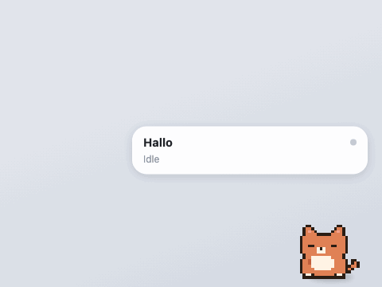
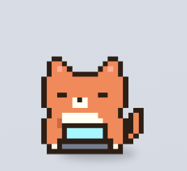
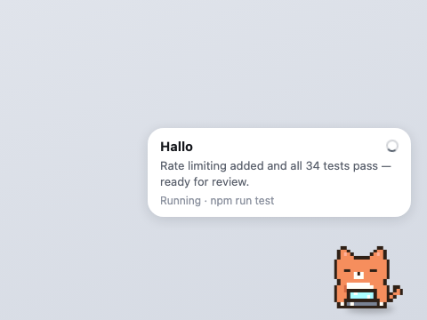
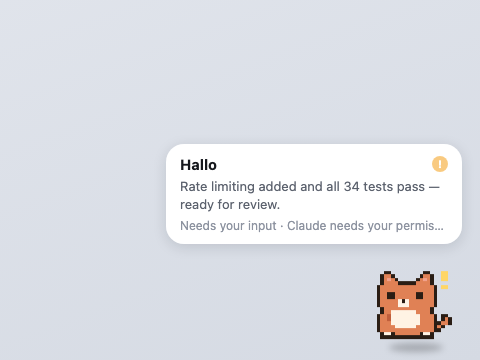
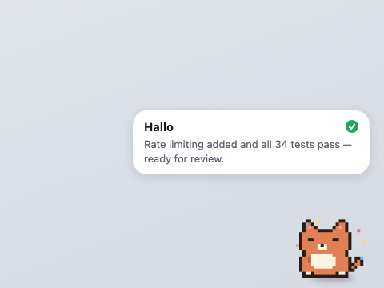
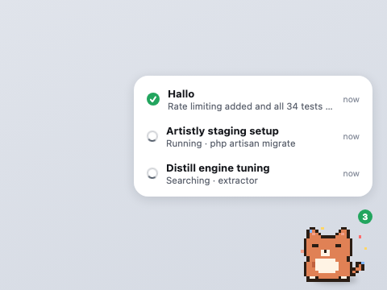
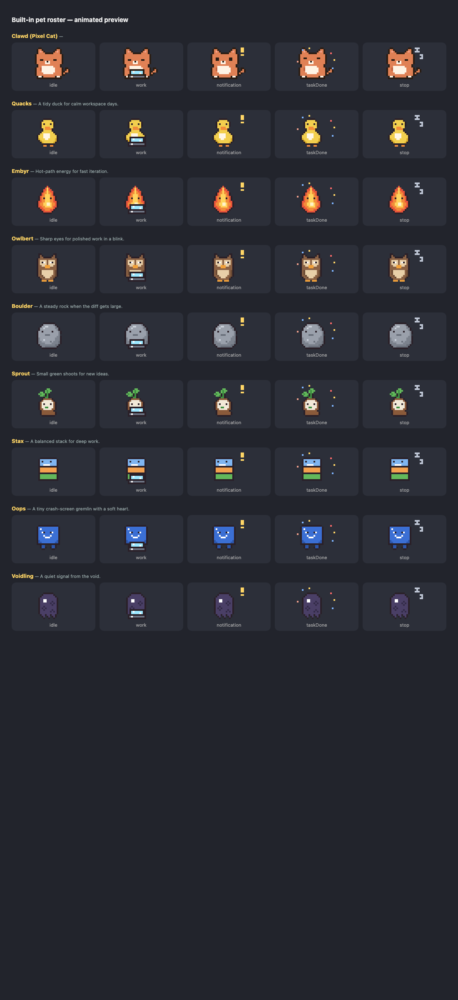

<div align="center">

# Claude Code Pet

**A pixel-art desk companion for Claude Code — for macOS, Windows & Linux.**

A little pixel creature floats above all your windows and reacts to what Claude Code is doing in real time. It shows the active chat, Claude's latest reply, what tool is running, and alerts you the moment Claude needs your input.



<br>



*Heads-down and typing while Claude works.*

<br>

**[▶ Live site](https://claudecodepet.vercel.app)**

 &nbsp;
 &nbsp;
 &nbsp;
 &nbsp;
[](https://github.com/ahfoysal/claude-code-pet)

</div>

---

## What it does

<table>
<tr>
<td width="50%"><br><b>Working</b> — types on its laptop while Claude runs; the bubble shows the chat name, Claude's latest reply, and the exact action (<code>Running · npm test</code>) with a spinner.</td>
<td width="50%"><br><b>Needs you</b> — a red <code>!</code> pops up, the status blinks, and a chime plays when Claude asks for permission. The alert stays until you respond.</td>
</tr>
<tr>
<td width="50%"><br><b>Ready for review</b> — a green check and a soft ding when a turn finishes, with Claude's summary kept in the bubble.</td>
<td width="50%"><br><b>Multiple sessions</b> — a badge counts active chats; click it for a panel listing each one by name, state, and last activity.</td>
</tr>
</table>

## Features

- **Floating overlay** — always on top, visible on every macOS Space *and* over fullscreen apps. No Dock icon.
- **Real-time, real source** — driven by Claude Code hooks and session transcripts, never fake timers. States: idle · thinking · reading · writing · running · searching · browsing · waiting · review · error.
- **Live status bubble** — active chat name, Claude's latest reply, current action, and a spinner while working.
- **Needs-input alerts** — visual `!`, blinking status, and an optional chime; the alert persists until you answer.
- **Session panel** — every open Claude chat with its title, state, and relative time. Auto-opens when two or more are busy.
- **Click to jump** — click the pet or the bubble to bring the Claude app to the front.
- **Sound alerts** — subtle WebAudio chimes for needs-input, done, and error. Toggleable, no audio files.
- **9 built-in pets** + custom pets via deep link. Right-click and pick a Theme to switch.
- **Follows you** — remembers where you drag it (clamped on-screen), waddles while dragging, hops on hover.
- **Safe by design** — the event bridge is local-only (`127.0.0.1`), hook payloads are display-only (never executed), and hook install writes a timestamped backup of your settings.

## The pet roster

All original pixel art, animated per state (breathing idle, laptop-typing while working, `!` alerts, Zzz sleep, confetti on review):

| Pet | Vibe |
|---|---|
| **Clawd** | The original Claude companion |
| **Quacks** | A tidy duck for calm workspace days |
| **Embyr** | Hot-path energy for fast iteration |
| **Owlbert** | Sharp eyes for polished work in a blink |
| **Boulder** | A steady rock when the diff gets large |
| **Sprout** | Small green shoots for new ideas |
| **Stax** | A balanced stack for deep work |
| **Oops** | A tiny crash-screen gremlin with a soft heart |
| **Voidling** | A quiet signal from the void |

<div align="center"></div>

All roster art is generated from ASCII grids — see [`tools/gen-pet-pack.mjs`](tools/gen-pet-pack.mjs). Right-click the pet and pick a theme to switch.

## Install

**macOS** is the primary, fully-tested platform. **Windows** builds in CI and is functional but less battle-tested (a couple of niceties like click-to-focus use a best-effort path there). **Linux** builds in CI too (`.deb` / `.rpm` / `.AppImage`) but is **build-verified only — not yet runtime-tested**: the transparent, always-on-top, click-through overlay is reliable on **X11** and unverified on **Wayland**, and click-to-focus needs `wmctrl`. The pet is driven by the Claude Code **CLI + hooks** (there is no Claude Code desktop app on Linux) — run `claude` in a terminal and the pet reacts.

Pre-built installers are attached to each [Release](https://github.com/ahfoysal/claude-code-pet/releases) (macOS `.dmg`, Windows `.msi` / `.exe`, and — from the first tag cut after the Linux CI leg landed — Linux `.AppImage` / `.deb` / `.rpm`). Or build from source:

Requires [Rust](https://rustup.rs), Node 18+, and [Claude Code](https://claude.com/claude-code). Same first step everywhere:

```bash
git clone https://github.com/ahfoysal/claude-code-pet.git
cd claude-code-pet
npm install
npm run build
```

### macOS

```bash
./install.sh                                              # copies binary + pets to ~/.claude-code-pet
~/.claude-code-pet/claude-code-pet install-claude-hooks   # registers hooks (backs up settings.json first)
open "src-tauri/target/release/bundle/macos/Claude Code Pet.app"
```

Drag `Claude Code Pet.app` to `/Applications`. Optionally add it to **System Settings > General > Login Items** to always have it ready.

### Windows

```powershell
.\install.ps1                                             # copies binary + pets to %LOCALAPPDATA%\claude-code-pet
& "$env:LOCALAPPDATA\claude-code-pet\claude-code-pet.exe" install-claude-hooks
& "$env:LOCALAPPDATA\claude-code-pet\claude-code-pet.exe"
```

To start it with Windows, drop a shortcut to `claude-code-pet.exe` in your Startup folder (`shell:startup`).

### Linux

```bash
./install.sh                                              # copies binary + pets to ~/.claude-code-pet
~/.claude-code-pet/claude-code-pet install-claude-hooks   # registers hooks (backs up settings.json first)
~/.claude-code-pet/claude-code-pet                        # run it
```

Best on an **X11** (or XWayland) session; the overlay is unverified under native Wayland. Click-to-focus uses `wmctrl` — install it with `sudo apt install wmctrl` (or your distro's equivalent). Prebuilt `.AppImage` / `.deb` / `.rpm` are produced by CI and attached to Releases cut after the Linux leg landed.

### Opens with Claude

Once hooks are installed, the pet **auto-launches whenever you start a Claude Code session** — you don't have to open it manually. Single-instance protection means it never opens twice.

Hooks apply to sessions started **after** installation. Remove them any time:

```bash
# macOS / Linux
~/.claude-code-pet/claude-code-pet uninstall-claude-hooks
# Windows
& "$env:LOCALAPPDATA\claude-code-pet\claude-code-pet.exe" uninstall-claude-hooks
```

## Controls

| Action | Result |
|---|---|
| **Click the pet** | Bring the Claude app to the front |
| **Click the bubble** | Bring the Claude app to the front |
| **⌄ (hover the pet)** or **double-click** | Tuck the pet away; click it to wake |
| **Click the count badge** | Open / close the session panel |
| **Drag** | Move it (position remembered); it waddles while moving |
| **Hover** | Playful hops |
| **Right-click** | Theme · Language · Focus Mode · Sound Alerts · Refresh Pets · Reset · Quit |

**Focus Mode** reacts only to completions, errors, and notifications. **Sound Alerts** chime on needs-input (two rising notes), done (soft ding), and error (low buzz).

## Install a pet from a link

Codex-style deep link — `name` required, `imageUrl` required and HTTPS, `description` optional:

```
claude-code-pet://pets/install?name=Robo&imageUrl=https://example.com/robo.png&description=My%20robot
```

The image downloads into `~/.claude-code-pet/themes/<slug>/` and the pet switches to it immediately. Try it:

```bash
open "claude-code-pet://pets/install?name=Robo&imageUrl=https://raw.githubusercontent.com/twitter/twemoji/master/assets/72x72/1f916.png"
```

Custom pets can also be authored by hand under `~/.claude-code-pet/themes/<id>/config.json`:

```json
{
  "name": "My Pet",
  "type": "image",
  "states": {
    "idle": { "frames": ["idle-1.png", "idle-2.png"], "fps": 2 },
    "work": { "src": "work.png" }
  }
}
```

States: `idle, thinking, read, write, bash, search, web, task, subagent, success, taskDone, error, notification, stop, sessionStart, sessionEnd`. Missing states fall back sensibly.

## How it works

```
Claude Code hooks ──▶ claude-code-pet --hook ──▶ TCP 127.0.0.1:19876 ──▶ pet window
   (~/.claude/settings.json)   (fast sender)          (local only)        (Tauri overlay)
```

Three channels feed the pet, all local:

1. **Hooks** (real-time) — `PreToolUse`, `PostToolUse`, `Notification`, `UserPromptSubmit`, `Stop`, etc. drive live state and the exact tool/command.
2. **Session snapshots** — the Claude app's local session store supplies chat titles (the "Recents" names) and archive state.
3. **Transcript tail** — `~/.claude/projects/*.jsonl` is followed for Claude's latest reply and for sessions started before hooks existed.

Hooks take priority per session; the others fill in titles and replies. Nothing leaves your machine, and hook payloads are display data only — never executed.

The state model is real events with lightweight timeout cleanup (a stalled turn settles back to idle, finished/errored states linger briefly) — not simulated activity.

## Privacy

By default the pet keeps **no log** of hook payloads. If you want the event checker (below) or a debug trail, opt in per shell:

```bash
export CLAUDE_CODE_PET_LOG=1   # writes events to ~/.claude-code-pet/events.jsonl
```

Only enable this if you're comfortable with prompts and tool metadata being written to that local file.

## Verify the event pipeline

With `CLAUDE_CODE_PET_LOG=1` set, a one-file checker (no dependencies) shows a live verdict and every event as it arrives:

```bash
node tools/event-check/server.mjs      # http://localhost:5600
```

Preview the whole pet roster animated: serve `src/` and open `sprites.html`.

## Landing page

A Next.js marketing site lives in [`landing/`](landing) — animated with the real pet sprites. Deploy your own to Vercel in one click (set **Root Directory** to `landing`):

[](https://vercel.com/new/clone?repository-url=https://github.com/ahfoysal/claude-code-pet&root-directory=landing&project-name=claude-code-pet&repository-name=claude-code-pet)

## License

[MIT](LICENSE) © ahfoysal
